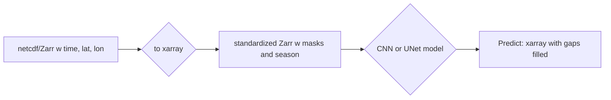

# Mind the CHL Gap

Create a tutorial on gap-free Indian Ocean gridded data with U-Net method


The basic approach is the following:


Functions are in `mindthegap` directory.
```
import mindthegap as mtg
```

## Collaborators

| Name                | Role                |
|---------------------|---------------------|
| Eli       | Project Facilitator |
| Bruna       | Fellow         |
| Trina       | Participant         |
| Lilac | Participant |


## Planning

* Initial idea: Create a tutorial on gap-free Indian Ocean gridded data with U-Net method
* [Pitch slide](https://docs.google.com/presentation/d/14JyNPC2JicP1IkHbWcDI0xt0FRbDmtdW4NTQo8wN80M/edit?slide=id.g37b3811c38a_11_5#slide=id.g37b3811c38a_11_5)
* Slack channel: ohw25_proj_gap
* repo: [https://github.com/oceanhackweek/ohw25_proj_gap](https://github.com/oceanhackweek/ohw25_proj_gap)
* Final presentation: Add link

## Background

## Goals

## Datasets

```
import xarray as xr
dataset = xr.open_dataset(
    "gcs://nmfs_odp_nwfsc/CB/mind_the_chl_gap/IO.zarr",
    engine="zarr",
    backend_kwargs={"storage_options": {"token": "anon"}},
    consolidated=True
)
dataset
```

## Workflow/Roadmap

## Results/Findings

## Lessons Learned

## References

## Creating the JupyterBook

Create template in `book` directory
```
pip install -U jupyter-book
jupyter-book create book
```

Build and push to GitHub. Make sure you are in `book` dir.
```
jupyter-book build .
ghp-import -n -p -f _build/html
```

