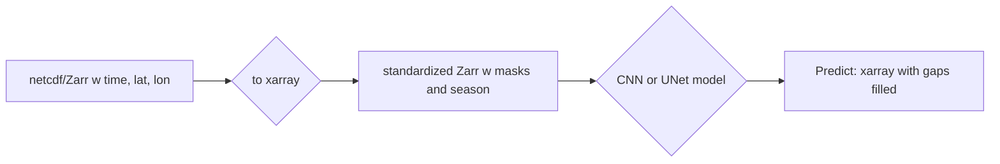

# Mind the CHL Gap

Create a tutorial on gap-free Indian Ocean gridded data with U-Net method


The basic approach is the following:


Functions are in `mindthegap` directory.
```
import mindthegap as mtg
```

## Collaborators

| Name                | Role                |
|---------------------|---------------------|
| [Eli Holmes](https://github.com/eeholmes)      | Project Facilitator |
| [Bruna Cândido](https://github.com/brunacandido)       | Fellow         |
| [Trina Xavier](https://github.com/trinaxavier2001)       | Participant         |
| [Lilac Hong](https://github.com/LilacHo) | Participant |


## Planning

* Initial idea: Create a tutorial on gap-free Indian Ocean gridded data with U-Net method
* [Pitch slide](https://docs.google.com/presentation/d/14JyNPC2JicP1IkHbWcDI0xt0FRbDmtdW4NTQo8wN80M/edit?slide=id.g37b3811c38a_11_5#slide=id.g37b3811c38a_11_5)
* Slack channel: ohw25_proj_gap
* repo: [https://github.com/oceanhackweek/ohw25_proj_gap](https://github.com/oceanhackweek/ohw25_proj_gap)
* [Final presentation](https://gamma.app/docs/Daily-Gap-Filled-Chlorophyll-a-Datasets-Using-Deep-Neural-Network-ozsc5xmxri96od1?mode=doc)

## Background
Chlorophyll is a widely used indicator of plankton abundance, and thus a key measure of marine productivity and ecosystem health, since the ocean covers nearly 70% of Earth’s surface. Estimating chlorophyll concentrations allows researchers to assess phytoplankton biomass, which supports oceanic food webs and contributes to global carbon cycling. Remote sensing with ocean-color instruments enables large-scale monitoring of chlorophyll-a by detecting the light reflectance of plankton. However, cloud cover continues to be a significant challenge, obstructing surface observations and creating gaps in chlorophyll-a data. These gaps limit our ability to monitor marine productivity accurately and to quantify the contribution of plankton to the global carbon cycle.

## Goals
Contribute to ["mind-the-chl-gap" project](https://github.com/ocean-satellite-tools/mind-the-chl-gap/tree/main) and the create a tutorial on gap-free Indian Ocean gridded data with U-Net method.
For OceanHackWeek 2025, we aimed to extend the existing work by exploring different types of CNN architectures and experimenting with alternative gap-filling tools, such as [segmentation_models_pytorch](https://github.com/qubvel-org/segmentation_models.pytorch), [DINCAE](https://github.com/gher-uliege/DINCAE.jl/tree/main).


## Datasets

```
import xarray as xr
dataset = xr.open_dataset(
    "gcs://nmfs_odp_nwfsc/CB/mind_the_chl_gap/IO.zarr",
    engine="zarr",
    backend_kwargs={"storage_options": {"token": "anon"}},
    consolidated=True
)
dataset
```

## Workflow/Roadmap

## Results/Findings

## Lessons Learned

## References

## Creating the JupyterBook

Create template in `book` directory
```
pip install -U jupyter-book
jupyter-book create book
```

Build and push to GitHub. Make sure you are in `book` dir.
```
jupyter-book build .
ghp-import -n -p -f _build/html
```

